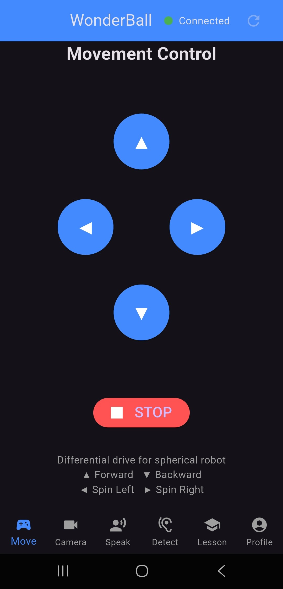
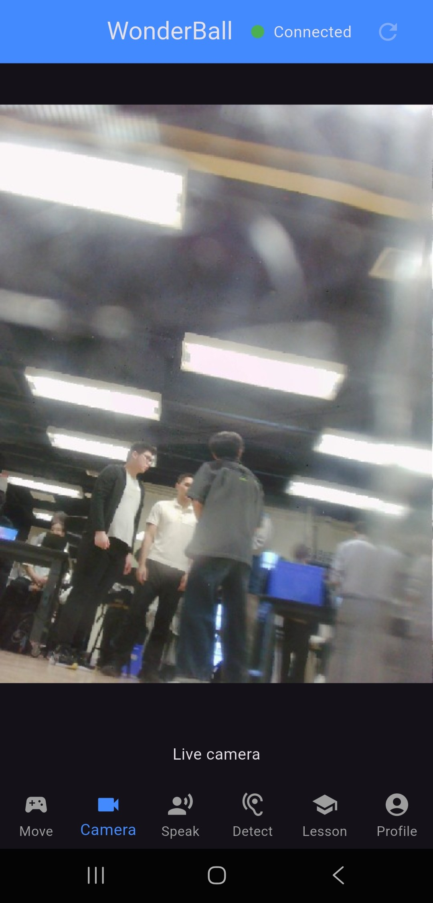
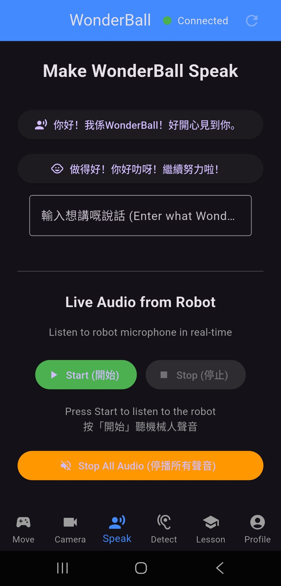
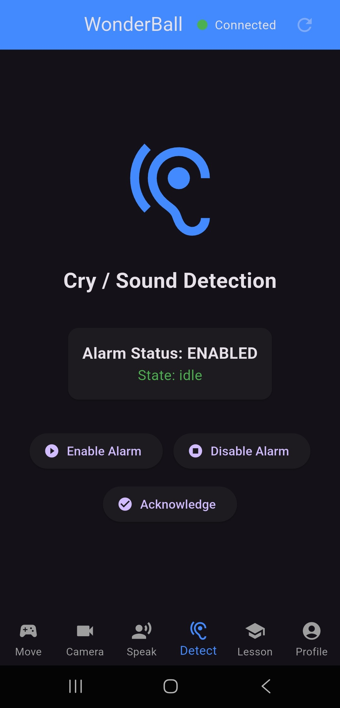
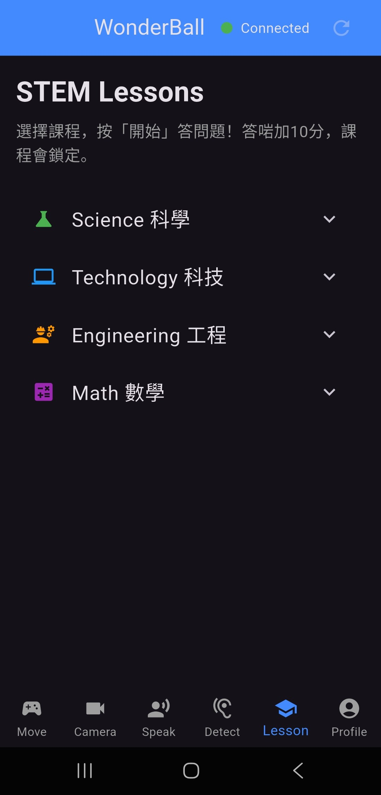
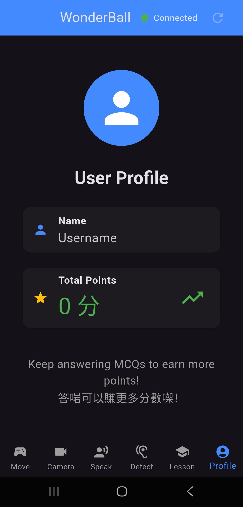

# WonderBall Parent App (Flutter)

WonderBall is a parent-facing Flutter app for a spherical home robot. It supports remote robot interaction, child monitoring, and STEM learning activities.

This repository contains a school-project prototype for the mobile app.

Backend robotics services are implemented in a separate repository:
- https://github.com/AnaOnTram/Spherical_STEM_Robot

## Academic Prototype Notice

- This is an educational prototype, not a production-ready commercial product.
- The backend repository is maintained by a teammate and integrated here as an external dependency.
- Several workflows are intentionally simplified for coursework demonstrations and testing.

## Scope of This Repository

This repository contains only the Flutter app.

Backend responsibilities (robot control, camera/gesture processing, detection, and TTS/audio pipelines) are implemented in the backend repository above.

## Current App Features

- Robot connection health check via `/api/status` (home app bar indicator, auto-refresh every 10s)
- Movement control via:
  - `/api/movement/move`
  - `/api/movement/stop`
- Camera preview via snapshot polling (`/api/stream/snapshot`, every 100ms)
- Audio features:
  - Live mic listen stream from robot (`/api/stream/audio`)
  - Stop robot audio (`/api/audio/stop`)
  - Backend TTS (`/api/tts/speak`, default voice `zh-HK-HiuGaaiNeural`)
  - TTS fallback path: Google TTS -> `/api/audio/play-base64`
  - Playback status endpoint available in service layer: `/api/audio/playback-status`
- Cry/sound alarm controls:
  - `/api/alarm/status` (polled every 2s)
  - `/api/alarm/enable`
  - `/api/alarm/disable`
  - `/api/alarm/acknowledge`
  - In-app alarm trigger notice (sound + dialog) when state changes to `confirmed` or `alarming`
- STEM lesson flow:
  - Lesson quiz session start/stop via `/api/quiz/start` and `/api/quiz/stop`
  - Gesture intake from WebSocket (`/ws`, `gesture_detected` subscription)
  - REST fallback polling for gesture robustness (`/api/gesture/status`, every 900ms)
  - Gesture normalization and duplicate-event filtering in app service layer
  - Child gesture auto-selects option when detected, parent can confirm/override in dialog
  - Lesson image push to e-ink display (`/api/display/update`) with local grayscale conversion (400x300 PNG base64)
  - Correct answer awards +10 points and triggers robot spin celebration (`/api/movement/move`)
  - Completed lesson is locked for current app runtime session

## App Screens

Bottom navigation pages currently implemented:
- Move
- Camera
- Speak
- Detect
- Lesson
- Profile

## App Screenshots

Screenshots below are from online mode (robot connected).

| Move | Camera | Speak |
|---|---|---|
|  |  |  |

| Detect | Lesson | Profile |
|---|---|---|
|  |  |  |

## Project Structure

`lib/`
- `main.dart`: app shell, bottom navigation, connection check timer, global points state
- `core/constants.dart`: base URL constant (`piBaseUrl`)
- `screens/`: feature UIs (`movement`, `camera`, `speaker`, `detection`, `lesson`, `profile`)
- `services/`: API, TTS fallback logic, audio stream playback, e-ink conversion, gesture stream/polling
- `models/`: typed data models (for example, alarm status)
- `widgets/`: reusable UI controls (`ControlButton`, `LessonButton`)
- `utils/`: shared UI feedback helper (success/error SnackBars)

## API Integration Notes

Primary API reference:
- https://github.com/AnaOnTram/Spherical_STEM_Robot/blob/main/API.md

Contract details currently used by this app:
- REST base URL: `http://<raspberry-pi-ip>:8000`
- WebSocket URL: `ws://<raspberry-pi-ip>:8000/ws`
- Gesture event type: `gesture_detected`
- Finger-count mapping in app: `1->A`, `2->B`, `3->C`, `4->D`
- Quiz voice currently sent by app: `zh-HK-HiuGaaiNeural`
- Alarm states handled by app: `confirmed`, `alarming` (alert), plus status display for other backend states

## Setup (Flutter App)

1. Install Flutter SDK (stable channel).
2. Clone this repository.
3. Install dependencies:

```bash
flutter pub get
```

4. Set the robot API host in `lib/core/constants.dart`:

```dart
const String piBaseUrl = 'http://<your-robot-ip>:8000';
```

5. Run the app:

```bash
flutter run
```

## Setup (Backend Robot Service)

Follow backend quick start:
- https://github.com/AnaOnTram/Spherical_STEM_Robot#quick-start

Backend ownership note:
- The backend service is developed in a separate teammate-managed repository.

## Dependencies

From `pubspec.yaml`:
- `http`: REST API calls
- `just_audio`: live robot audio stream playback
- `image`: image processing for e-ink payload generation
- `web_socket_channel`: real-time gesture event subscription

## Current Prototype Limitations

- Lesson completion and total points are in-memory only and reset when app restarts.
- User profile data is static placeholder data in the app shell.
- App-side notifications are in-app dialogs/snackbars only; no OS push notifications.
- Camera/gesture/detection reliability still depends on backend availability, network quality, and physical environment (angle, lighting, hand visibility).
- Several backend endpoints are wrapped in service code but not all are currently surfaced with dedicated UI states.

## Acknowledgements

- WonderBall backend contributors:
  https://github.com/AnaOnTram/Spherical_STEM_Robot
- This app repository provides parent mobile control and interaction for the WonderBall ecosystem.
- School project team collaboration made this prototype possible.